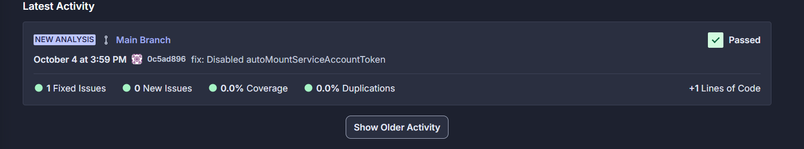

# Simple Web Application

<!-- Back to Top Navigation Anchor -->
<a name="readme-top"></a>

<div align="center">
  <a href="https://github.com/Adekemi02/devsecops-project">
    
  </a>
</div>

---

<div align="center">
  <h1>
  </h1>
</div>

<div>
  <p align="center">
    <a href="https://github.com/Adekemi02/devsecops-project#readme"><strong>Explore the Docs »</strong></a>
    <br />
    <a href="https://github.com/Adekemi02/devsecops-project/blob/main/images/sonarcloud-report2.png">View Demo</a>
    ·
    <a href="https://github.com/Adekemi02/devsecops-project/issues">Report Bug</a>
    ·
    <a href="https://github.com/Adekemi02/devsecops-project/issues">Request Feature</a>
  </p>
</div>

---

<!--- Table of Contents --->

<details>
  <summary>Table of Contents</summary>
  <ol>
    <li>
      <a href="#about-simple-web-application">About Simple Web Application</a>
      <ul>
        <li><a href="#built-with">Built With</a></li>
      </ul>
    </li>
    <li><a href="#contanerization">Containerization</a></li>    
    <li><a href="#CI/CD-process">CI/CD Process</a></li>
    <li><a href="#requirements">Requiremments</a></li>
    <li><a href="#running-project-locally">Running Project Locally</a></li>
    <li><a href="#deployment-on-kubernetes">Deployment on Kubernetes</a></li>
    <li><a href="#github-actions-ci/cd-configuration">GitHub Actions CI/CD Configuration</a></li>
    <li><a href="#security-measures">Security Measures</a></li>
    <li><a href="#contact">Contact</a></li>
    <li><a href="#contributing">Contributing</a></li>
    <li><a href="#license">License</a></li>
  </ol>
  <p align="right"><a href="#readme-top">back to top</a></p>
</details>

---

## About Simple Web Application

The Simple Web Application Flask API is designed to provide a lightweight RESTful API built with Flask. It allows users to perform basic CRUD operations, showcasing the essential features of a modern web application. The API is containerized using Docker for easy deployment and scalability.

---

## Built with

  and 

---

## Containerization

The API was containerized using Docker by creating a `Dockerfile` that defines the environment for the Flask application. The image is built and pushed to Docker Hub, allowing it to be pulled and deployed on any container orchestration platform.

---

## CI/CD Process
The Continuous Integration and Continuous Deployment (CI/CD) process is automated using GitHub Actions. The workflow is defined in 
`.github/workflows/main.yml`
which includes steps for:
- Building the Docker image.
- Running tests using Pytest.
- Pushing the Docker image to Docker Hub.
- Deploying the application to a Kubernetes cluster.

---

## Requirements

Below are the requirements to get this working on a base linux system

- Docker or install [here](https://docs.docker.com/engine/install/)
- Kubernetes (KinD) or install [here](https://kind.sigs.k8s.io/docs/user/quick-start#installation)
- kubectl or install [here](https://kubernetes.io/docs/tasks/tools/install-kubectl-linux/)
- GitHub account for CI/CD
- DockerHub account

---

## Running the Project Locally

To run the project locally, follow these steps:
1. **Clone the Repository**
  ```bash
  git clone https://github.com/Adekemi02/devsecops-project.git
  cd simple-webapp-flask-master
  ```

2. **Install Python and its dependencies**
  ```bash
  apt-get install -y python3 python3-setuptools python3-dev build-essential python3-pip default-libmysqlclient-dev
  ```
  ```bash
  pip install -r requirements.txt
  ```

3. **Build the Docker Image**
  ```bash
  docker build -t simple-webapp-flask .
  ```

3. **Run the Docker Container**
  ```bash
  docker run -p 5000:80 simple-webapp-flask
  ```

4. **Open your web browser and go to http://localhost:5000**
  ```
  http://<IP>:5000                            => Welcome
  http://<IP>:5000/how%20are%20you            => I am good, how about you?
  ```

---

## Deployment on Kubernetes

The API is deployed on a Kubernetes cluster using the defined Kubernetes manifests. The deployment includes:
- A `Deployment` for managing the application pods.
- A `Service` for exposing the application.
- Role-Based Access Control (RBAC) with a `Role`, `RoleBinding`, and `ServiceAccount` for managing permissions.
- Security measures such as limiting the permissions of the service account and defining resource limits for the containers.

To deploy the API on Kubernetes, follow these steps:
1. **Set Up Your Kubernetes Cluster**
  ```bash
  kind create cluster
  ```
2. **Apply the Kubernetes Manifests**
  ```bash
  kubectl apply -f ./deployment.yml
  kubectl apply -f ./service.yml
  ```
3. **Use kubectl port-forward to access the application**
  ```bash
  kubectl port-forward service/simple-webapp-flask-service 5000:80
  ```
4. **Open your web browser and go to http://localhost:5000**
  ```
  http://<IP>:5000                            => Welcome
  http://<IP>:5000/how%20are%20you            => I am good, how about you?
  ```

---

## GitHub Actions CI/CD Configuration

The CI/CD workflow is defined in the `.github/workflows/main.yml` file. This file automates the build, test, and deployment processes. It includes:
- Build Stage: Builds the Docker image and scans it.
- Test Stage: Test the image upon successful build and pushes the Docker image to Docker Hub.
- Deploy Stage: Deploys the application to Kubernetes.

---

## Security Measures

1. **Role-Based Access Control (RBAC)**
  - Role and RoleBinding are implemented to restrict access to Kubernetes resources, ensuring that only the necessary permissions are granted. This limits the scope of operations the application and associated users can perform within the cluster, adhering to the principle of least privilege.

2. **Resource Limits**
  - Resource limits (CPU and memory) are specified in the Deployment manifest to ensure efficient resource allocation. These limits prevent resource starvation by capping how much CPU and memory the application can consume, preventing it from overwhelming the system and affecting other services.

3. **Service Account**
  - A ServiceAccount is assigned to the application to ensure it runs with minimal permissions. This limits the application's access to cluster-wide resources, increasing the security of the deployment by reducing unnecessary privileges.

4. **Code Quality Checks**
  - Flake8 is integrated into the CI/CD pipeline to scan the codebase for syntax errors, undefined names, and general code style issues. This ensures that the code adheres to best practices and is free from common errors, increasing the overall quality and maintainability of the project.

5. **Automated Testing**
  - The code is automatically tested using Pytest in the CI/CD pipeline. This suite of tests ensures the correctness of the code and validates that new changes do not break existing functionality, providing confidence in code stability.

6. **Vulnerability Scanning**
  - Trivy is integrated to scan the Docker images for vulnerabilities, specifically checking for any high or critical severity issues. This helps identify potential security risks early in the development cycle, ensuring the application is deployed with secure dependencies and packages.

## Sample

<div align="center">
  <h1>
  </h1>
</div>

---

## Contact

Barakat Adisa - [twitter](https://twitter.com/adisa_adekhemie) - 
[linkedin](https://linkedin.com/in/adekhemieadisa)
adisabarakatadekemi@gmail.com

Project Link: [DevSecOps Project](https://github.com/Adekemi02/devsecops-project)

---

## Contributing

Contributions are welcome! Please submit a pull request or open an issue if you have suggestions or find bugs.

---
## License

Distributed under the MIT License. See <a href="https://github.com/Adekemi02/devsecops-project?tab=MIT-1-ov-file">LICENSE</a> for more information.

---

